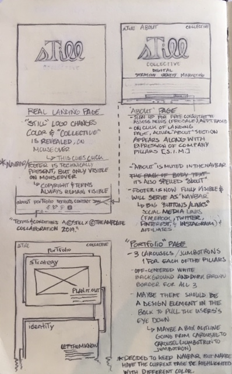
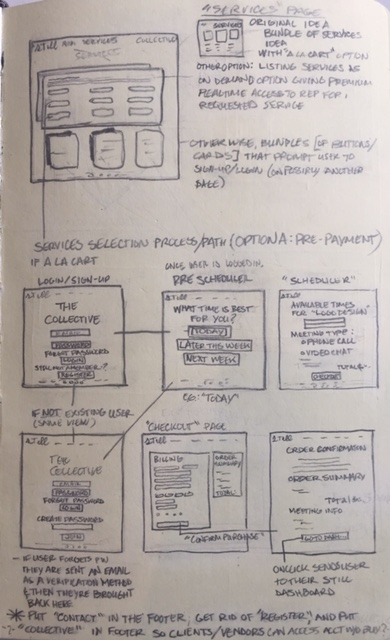
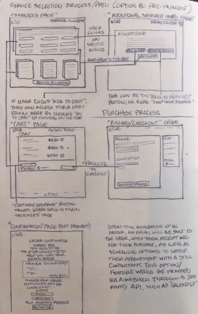
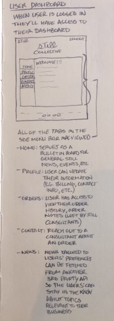

# StillCo_Final_Project_Frontend
This is the fully functional Front End of the web application for The Still Collective - "A marketplace for on-demand branding and business consulting services where clients and professionals meet". I conceptualized and wireframed the application, and mapped the business model and user experience of the site.

## Deployment Instructions (How to Open Project Live)
To view the site, click the following link:

https://ProspersMartin.github.io/The-Still-Collective/

## Build
  React.js, CSS, Bootstrap, Font Awesome, and Google Fonts and Google Fonts were used for this application's development. It is also fully integrated with its Back End counterpart.
  
## Layout

### Concept

  To get a more thorough understanding, and eventual development, of the Still Collective business and web application  structure, I wireframed the entire application. The following wireframe designs were meant to serve as a foundation for the design of the application, a preliminary layout...
  
  
  
  
  
  
  
  
